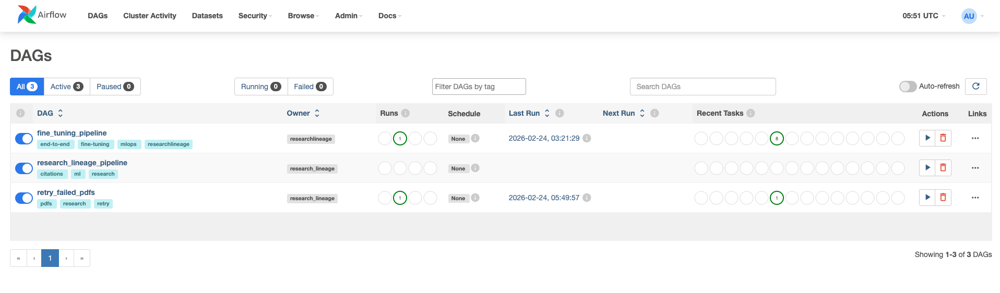
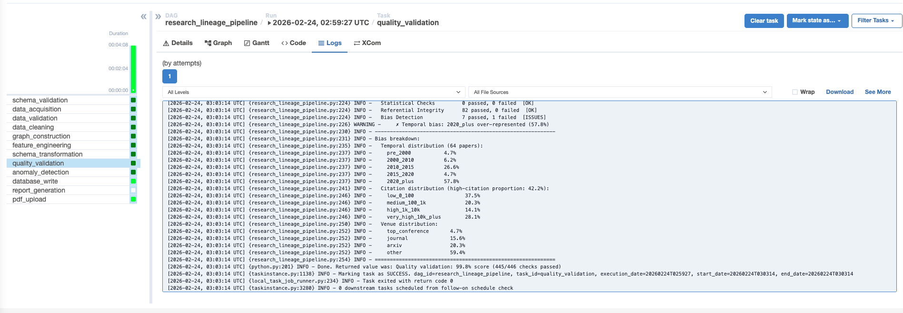
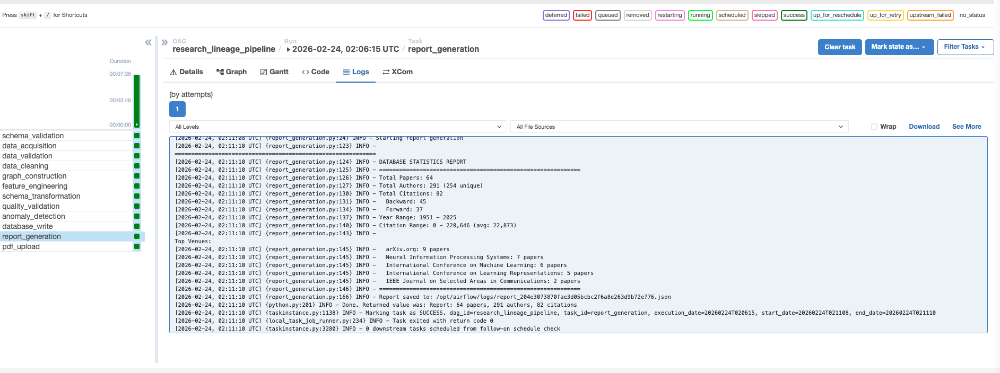
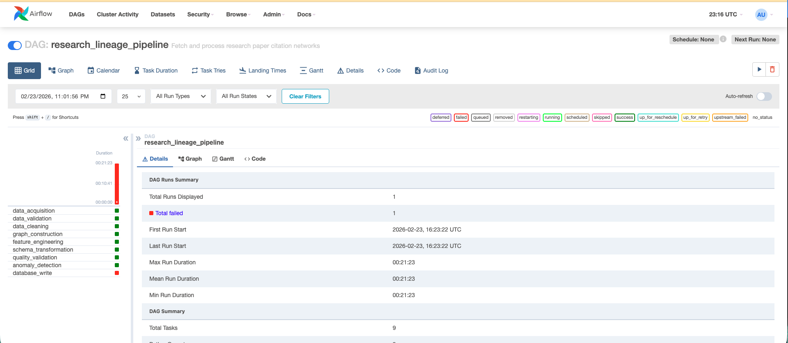
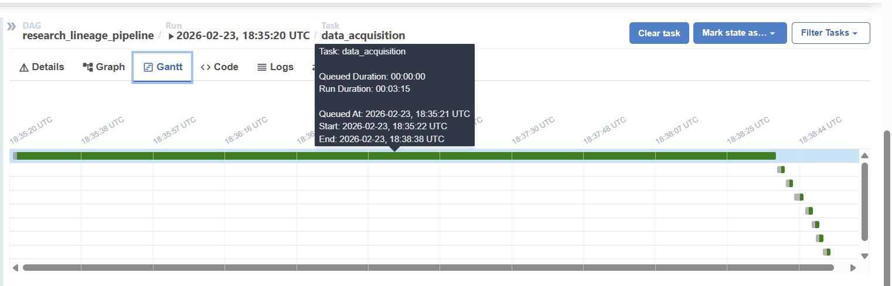
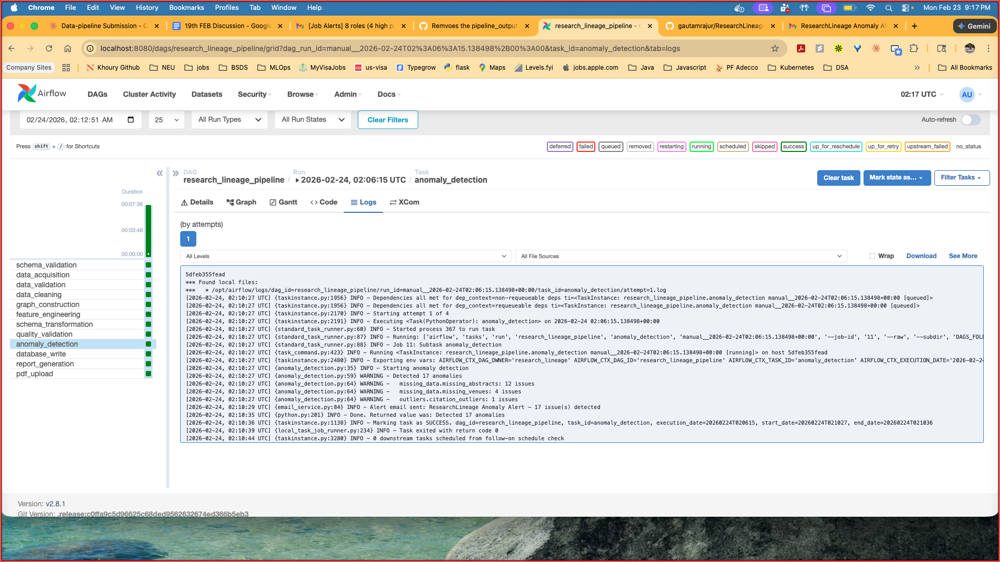
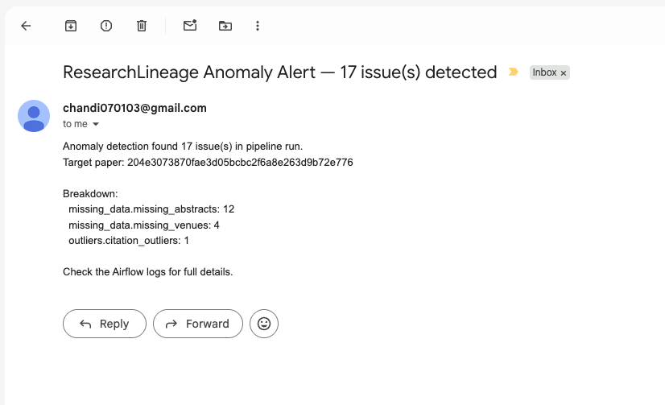
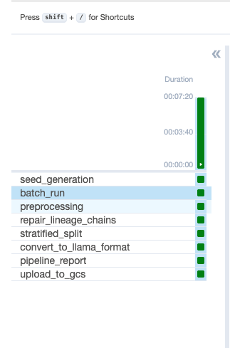
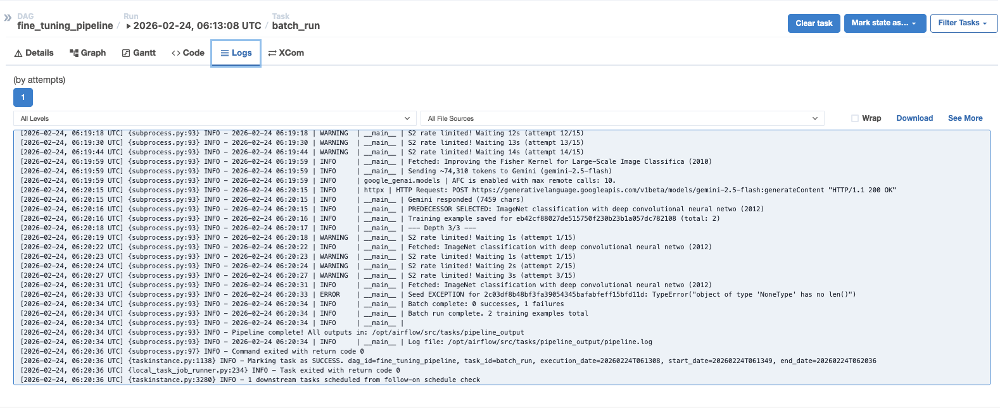
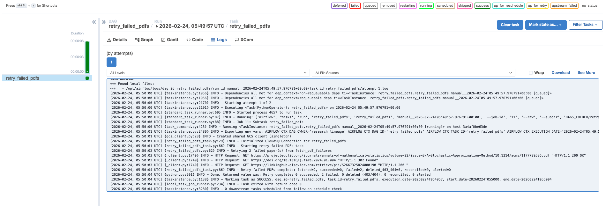

# ResearchLineage — LLM-Powered Research Lineage & Path Tracker

> *"We're not replacing comprehensive literature reviews. We're the Wikipedia of research lineages — a starting point that helps researchers get oriented 10x faster, so they can read the right papers in the right order with the right context."*

Given a seed paper ID, this pipeline crawls the Semantic Scholar citation graph, validates and cleans the data, builds a directed citation network, engineers influence features, detects anomalies, and writes structured results to a PostgreSQL database — all orchestrated by Apache Airflow running locally via Docker Compose, backed by GCP (Cloud SQL + GCS) and versioned with DVC. Three DAGs cover the full workflow: citation network analysis, fine-tuning data generation for Llama 3.1 8B, and a standalone PDF retry handler.

---

## Table of Contents

1. [Architecture](#architecture)
2. [Data Acquisition](#data-acquisition)
3. [Data Preprocessing](#data-preprocessing)
4. [Schema & Statistics Generation](#schema--statistics-generation)
5. [Pipeline Flow Optimization](#pipeline-flow-optimization)
6. [Anomaly Detection & Alerting](#anomaly-detection--alerting)
7. [Bias Detection & Mitigation (DAG 2)](#bias-detection--mitigation-dag-2)
8. [Error Handling](#error-handling)
9. [Tracking & Logging](#tracking--logging)
10. [Running Tests](#running-tests)
11. [Data Versioning (DVC)](#data-versioning-dvc)
12. [Project Structure](#project-structure)
13. [Prerequisites](#prerequisites)
14. [Setup & Reproducibility](#setup--reproducibility)
15. [Running the Pipeline](#running-the-pipeline)
16. [Configuration Reference](#configuration-reference)
17. [DAGs](#dags)

---

## Architecture

Three Airflow DAGs, all running locally via Docker Compose:

| DAG | Tasks | Operator | Trigger |
|---|---|---|---|
| `research_lineage_pipeline` | 11 + parallel pdf_upload | PythonOperator | Manual |
| `fine_tuning_pipeline` | 8 sequential | BashOperator | Manual |
| `retry_failed_pdfs` | 1 | PythonOperator | Manual |



### `research_lineage_pipeline` — 11-task flow

```
[T0]  schema_validation         — verify PostgreSQL tables exist
        ↓
[T1]  data_acquisition          — Semantic Scholar API crawl (async, depth-limited BFS)
        ↓                      ↘
[T2]  data_validation            [pdf_upload] → GCS   ← parallel branch, 120-min timeout
        ↓
[T3]  data_cleaning
        ↓
[T4]  citation_graph_construction
        ↓
[T5]  feature_engineering
        ↓
[T7]  schema_transformation
        ↓
[T8]  quality_validation         — 300–500 checks; ≥85% required
        ↓
[T9]  anomaly_detection          — Z-score > 3 outliers + email alert
        ↓
[T10] database_write             — upsert to Cloud SQL via Auth Proxy
        ↓
[T11] report_generation          — JSON stats report (papers, authors, citations, year range)
```

Inter-task data passes through Airflow **XCom**. The NetworkX graph is not serialised to XCom; only derived metrics are pushed downstream.

**Config:** `max_active_runs=1`, `retries=3`, `retry_delay=5m`, `execution_timeout=60m` (pdf_upload: 120m).

---

## Data Acquisition

**Sources:** Semantic Scholar (primary — metadata, citation intent, influence flags), arXiv (full-text HTML fallback), OpenAlex (API fallback when S2 rate-limits), Google Gemini (comparison pair generation, DAG 2 only).

**Three-layer caching:** Redis (48h TTL, ~60–70% hit) → PostgreSQL (permanent, ~20–30% hit) → live API. Combined live API miss rate: 10–20%.

**Inline filtering** runs before recursive BFS calls — citation intent (methodology/background only), influence flags, citation count threshold, adaptive depth limits (top 5/3/2 per depth). Result: **98% reduction in API calls** (10,000+ → 100–150 per run).

**Output:** JSONL with `instruction`, `prompt`, `response`, and `metadata` (paper IDs, years, citations, fields, depth, lineage chain). Supports `backward` / `forward` / `both` traversal. State file enables resume; fixed random seed ensures reproducibility.

---

## Data Preprocessing

### DAG 1 — Tasks 2–5

| Task | Key details |
|---|---|
| **T2 — Data Validation** | Schema, field presence, type/range checks; >10% error rate raises `ValidationError` and halts |
| **T3 — Data Cleaning** | Text normalisation, venue standardisation, deduplication, self-citation removal; ~80% of raw edges filtered |
| **T4 — Citation Graph** | NetworkX `DiGraph`; PageRank (α = 0.85), betweenness centrality, in/out-degree, connected components |
| **T5 — Feature Engineering** | Citation velocity, recency score, temporal category, years-from-target, composite influence score |

### DAG 2 — Preprocessing steps

- **preprocessing:** validates JSONL, drops malformed records
- **repair_lineage_chains:** reconstructs missing metadata via shared paper ID cross-reference
- **split + convert:** separates pairs from metadata sidecars; converts to Llama 3.1 8B chat format

---

## Schema & Statistics Generation

The pipeline automates schema verification and statistics generation at three points:

**T0 — Schema Validation:** `SchemaValidationTask` verifies all required PostgreSQL tables exist before any data is fetched. Fails fast if the schema is missing or incomplete.

**T8 — Quality Validation:** `QualityValidationTask` runs 300–500 checks across schema compliance, statistical properties, referential integrity, and distribution balance. A score below **85%** raises `DataQualityError` and halts before writing to the database.



| Dimension | Check | Threshold |
|---|---|---|
| **Temporal** | No single era > 50% of papers | 5 eras: pre-2000, 2000–2010, 2010–2015, 2015–2020, 2020+ |
| **Citation** | Distribution across high/medium/low cited papers | Flags if >70% high-citation |
| **Venue** | No single venue type > 60% | top-conference, arXiv, journal |

**T11 — Report Generation:** After each successful run, `ReportGenerationTask` produces a JSON statistics report: total papers, authors, citations, papers-by-year, top venues, citation stats, year range.



---

## Pipeline Flow Optimization

**Inline filtering** cuts API calls from 10,000+ (~6 h hypothetical) to 100–150 per run (2–3 min) — 98% reduction.

**Parallelisation:** after `data_acquisition`, `pdf_upload` branches off concurrently (120-min timeout) without blocking the main chain.

**Gantt analysis** pinpointed `data_acquisition` as the bottleneck. After enabling caching + filtering: **6m 02s → 3m 15s (46% faster)**, with `database_write` no longer timing out. Steady state: <5 min e2e, 60–80% cache hit rate, 95%+ task success.

Below — pre-optimization run where `database_write` failed after 21+ minutes:



After — `data_acquisition` completes in **3m 15s**, all downstream tasks finish in seconds:



---

## Anomaly Detection & Alerting

`AnomalyDetectionTask` (T9) detects the following anomaly types:

| Type | Detection method |
|---|---|
| Missing data (abstracts, years, venues) | Field presence check on every record |
| Statistical outliers (citation counts) | Z-score > 3 |
| Citation anomalies (self-citations, duplicates) | Post-cleaning verification pass |
| Disconnected papers (zero in/out degree) | Graph connectivity scan |
| API rate limit threshold breaches | Request counter threshold monitoring |

When `total_anomalies > 0`, an email alert is sent via `EmailService` (`src/utils/email_service.py`) — methods: `send_alert`, `send_pipeline_success`, `send_pipeline_error`.





**Sample alert:**

```
Subject: ResearchLineage Anomaly Alert — 5 issue(s) detected

Anomaly detection found 5 issue(s) in pipeline run.
Target paper: 204e3073870fae3d05bcbc2f6a8e263d9b72e776

Breakdown:
  missing_data.missing_abstracts: 2
  missing_data.missing_venues: 1
  citation_anomalies.duplicate_citations: 1
  disconnected_papers.disconnected_papers: 1

Check the Airflow logs for full details.
```

Alerts are **silently skipped** if SMTP credentials are not configured — the pipeline continues normally.

**Gmail setup:** Enable 2-Step Verification → generate an App Password at `myaccount.google.com/apppasswords` → use the 16-character code as `SMTP_PASSWORD`.

---

## Bias Detection & Mitigation (DAG 2)

> Applies **exclusively to `fine_tuning_pipeline`** (DAG 2). The main `research_lineage_pipeline` runs data quality validation at Task 8 — not bias mitigation.

Llama 3.1 8B is fine-tuned on ancestor paper selection and structured comparison generation. Naive random splitting inflates evaluation metrics because bibliometric signals and lineage graph overlap cause train/test leakage that sample-level deduplication cannot catch.

### Bias 1 — Shared Ancestor Overlap

Different seeds' lineage trees converge on shared papers (e.g. AlexNet, Transformer). A **union-find** algorithm clusters all samples that share any paper ID into the same split, preventing the model from exploiting memorised representations.

| Version | Samples | Clusters | Shared IDs (any split pair) |
|---|---|---|---|
| v1 | 184 | 94 | 0 |
| v2 | 293 | 163 | 0 |
| v3 | 392 | 259 | 0 |

### Bias 2 — Popularity Bias

Citation-based filtering risks a spurious popularity-relevance correlation. Citation counts are binned into five quantile tiers (`low / medium / high / very_high / landmark`) used as a stratification axis during splitting. All splits verified within **±7 pp** of the overall tier distribution across all versions.

### Bias 3 — Domain Imbalance

Unconstrained seed selection yields ~65% CS. Three rounds of targeted seed collection rebalanced the corpus:

| Field | v1 (184) | v2 (293) | v3 (392) |
|---|---|---|---|
| Computer Science | 66.8% | 57.7% | 50.5% |
| Physics | 19.0% | 27.0% | 34.9% |
| Mathematics | 14.1% | 15.3% | 14.6% |

Splits use composite keys (domain × tier) to stay within **±5 pp** per field. Math remains underrepresented (~15%) due to sparse S2 coverage — future work includes zbMATH/MathSciNet and lower citation thresholds for math seeds.

### Splitting Procedure

1. **Cluster formation** — union-find on shared paper IDs
2. **Cluster profiling** — dominant field, popularity tier, max year, size
3. **Stratified allocation** — composite key (domain × tier), temporal ordering, 70/15/15
4. **Integrity verification** — zero cross-split paper ID overlap confirmed

---

## Error Handling

Each task raises typed exceptions from `src/utils/errors.py`:

| Exception | Raised by | Condition |
|---|---|---|
| `ValidationError` | T1, T2 | Missing required fields, invalid types, >10% error rate |
| `DataQualityError` | T8 | Quality score below 85% threshold |
| `APIError` | T1 | Semantic Scholar / OpenAlex request failure |
| `RateLimitError` | T1 | API rate limit exceeded (429) |

**Graceful degradation:** Redis down → API-only; DB down → API fallback; rate limited → linear backoff (10 retries, up to 275 s); partial API failures → logged and skipped; SMTP absent → alerts silently skipped; PDF 403/404 → removed from retry queue.

---

## Tracking & Logging

All logging is centralised through `src/utils/logging.py`. Every module uses the same entry point:

```python
from src.utils.logging import get_logger
logger = get_logger(__name__)
```

The root logger is auto-configured on first import with a consistent format:

```
2026-02-23 14:32:01 | INFO     | src.tasks.data_validation | Starting validation
2026-02-23 14:32:01 | WARNING  | src.tasks.anomaly_detection | Detected 3 anomalies
```

`LOG_LEVEL` in `.env` controls verbosity (default: `INFO`; set to `DEBUG` for verbose output).

**DAG 1** logs per-task progress, validation results, and cache hit rates via Airflow task logs.

**DAG 2** writes dual output: `INFO`+ to Airflow logs and a full `DEBUG`-level trace to `data/tasks/pipeline_output/pipeline.log`.

---

## Running Tests

Tests are fully isolated — no live API calls, no database connections required.

### Option A: Docker (recommended)

```bash
docker build -f Dockerfile.test -t researchlineage-tests .
docker run --rm -v $(pwd)/reports:/app/reports researchlineage-tests
```

Open `reports/report.html` for the full results dashboard.

Expected result: **171 passed, 1 warning**

The warning is a harmless Pydantic v2 deprecation in `src/utils/config.py` — does not affect functionality.

### Option B: Local

```bash
poetry run pytest tests/ -v
```

### Test coverage

| File | Tests | Scope |
|---|---|---|
| `test_data_acquisition.py` | 29 | Input/output validation, reference/citation filtering logic |
| `test_data_validation.py` | 21 | Schema checks, 10% error-rate threshold, self-citation removal |
| `test_data_cleaning.py` | 18 | Deduplication, venue normalisation, referential filtering |
| `test_citation_graph.py` | 18 | Graph construction, metrics, edge cases (empty graph) |
| `test_feature_engineering.py` | 16 | Feature completeness, normalisation, temporal categories |
| `test_schema_transformation.py` | 17 | Field mapping, ArXiv ID extraction, author UUID fallback |
| `test_quality_validation.py` | 21 | Quality checks, referential integrity, 85% quality threshold |
| `test_anomaly_detection.py` | 14 | Z-score outliers, duplicates, disconnected nodes |
| `test_pipeline_e2e.py` | 18 | Full Tasks 2–9 chain, data integrity across stages |
| **Total** | **171** | 153 unit + 18 integration |

---

## Data Versioning (DVC)

DVC tracks raw/processed research data and fine-tuning artifacts. All data is stored in GCS. The remote is pre-configured in `.dvc/config` — no additional setup required.

### Remote

```
gs://researchlineage-gcs/dvc-store
```

Authentication uses the same GCP credentials as the rest of the project (`GCLOUD_CONFIG_DIR`).

### Tracked datasets

| DVC pointer | DAG | Contents |
|---|---|---|
| `data/raw.dvc` | `research_lineage_pipeline` | Raw API responses from Semantic Scholar |
| `data/processed.dvc` | `research_lineage_pipeline` | Cleaned, validated, and feature-engineered datasets |
| `data/tasks/pipeline_output/splits.dvc` | `fine_tuning_data_pipeline` | Stratified train / val / test splits (70 / 15 / 15) |
| `data/tasks/pipeline_output/llama_format.dvc` | `fine_tuning_data_pipeline` | Llama chat-format training files and metadata sidecars |

`.dvc` pointer files are committed to Git; actual data is not.

### Pull existing data

```bash
dvc pull
```

### Push new data after a pipeline run

> **Note:** Both DAGs automatically upload artifacts to GCS under a timestamped path (`{gcs_prefix}/{run_id}/`) at the end of each run. This is independent of DVC. The steps below are a **manual post-run step** to create a reproducible, git-linked snapshot restorable with `dvc pull`.

**Research lineage pipeline:**

```bash
dvc add data/raw data/processed
dvc push
git add data/raw.dvc data/processed.dvc
git commit -m "Update research lineage datasets"
```

**Fine-tuning pipeline:**

```bash
dvc add data/tasks/pipeline_output/splits data/tasks/pipeline_output/llama_format
dvc push
git add data/tasks/pipeline_output/splits.dvc data/tasks/pipeline_output/llama_format.dvc
git commit -m "Track fine-tuning artifacts from pipeline run"
```

### Retrieve data from a specific past run

```bash
git log --oneline data/raw.dvc
git checkout <commit-hash> -- data/raw.dvc
dvc pull data/raw.dvc
```

---

## Project Structure

```
.
├── dags/
│   ├── research_lineage_pipeline.py   # Main 11-task citation pipeline DAG
│   ├── fine_tuning_data_pipeline.py   # Fine-tuning data generation DAG (8 BashOperator tasks)
│   └── retry_failed_pdfs_dag.py       # Standalone PDF retry DAG
│
├── src/
│   ├── api/
│   │   ├── semantic_scholar.py        # Async S2 client with retry/backoff
│   │   ├── openalex.py                # OpenAlex enrichment client
│   │   └── base.py                    # Base HTTP client
│   ├── cache/
│   │   └── redis_client.py            # Redis-based request cache (TTL=48h)
│   ├── database/
│   │   ├── connection.py              # SQLAlchemy engine + session factory
│   │   └── repositories.py            # Upsert helpers for each table
│   ├── tasks/                         # One class per pipeline task
│   │   ├── schema_validation.py       # T0 — DB schema existence check
│   │   ├── data_acquisition.py        # T1 — async BFS crawl
│   │   ├── data_validation.py         # T2 — schema + type validation
│   │   ├── data_cleaning.py           # T3 — dedup, normalise
│   │   ├── citation_graph_construction.py  # T4 — NetworkX graph
│   │   ├── feature_engineering.py     # T5 — derived features
│   │   ├── schema_transformation.py   # T7 — flatten to tables
│   │   ├── quality_validation.py      # T8 — 300–500 quality checks
│   │   ├── anomaly_detection.py       # T9 — statistical anomaly detection + email alert
│   │   ├── database_write.py          # T10 — PostgreSQL upsert
│   │   ├── report_generation.py       # T11 — JSON statistics report
│   │   ├── pdf_upload_task.py         # Parallel branch — fetch + GCS upload
│   │   ├── retry_failed_pdfs_task.py  # DAG 3 — retry failed PDF fetches
│   │   └── lineage_pipeline.py        # Fine-tuning pipeline step runner (DAG 2)
│   └── utils/
│       ├── config.py                  # Pydantic BaseSettings (reads .env)
│       ├── errors.py                  # ValidationError, DataQualityError, APIError
│       ├── id_mapper.py               # S2 ↔ ArXiv ID mapping
│       ├── logging.py                 # Centralised logging — single get_logger entry point
│       └── email_service.py           # SMTP email alert service
│
├── tests/
│   ├── conftest.py                    # Shared factory helpers (make_paper, make_ref, make_cit)
│   ├── unit/
│   │   ├── conftest.py                # Per-task input fixtures
│   │   ├── test_data_acquisition.py   # 29 tests (all external deps mocked)
│   │   ├── test_data_validation.py    # 21 tests
│   │   ├── test_data_cleaning.py      # 18 tests
│   │   ├── test_citation_graph.py     # 18 tests
│   │   ├── test_feature_engineering.py  # 16 tests
│   │   ├── test_schema_transformation.py # 17 tests
│   │   ├── test_quality_validation.py # 21 tests
│   │   └── test_anomaly_detection.py  # 14 tests
│   └── integration/
│       ├── conftest.py                # Full pipeline chain fixture (Tasks 2–9, no live APIs)
│       └── test_pipeline_e2e.py       # 18 end-to-end tests
│
├── data/
│   ├── raw.dvc                            # DVC pointer — raw Semantic Scholar responses
│   ├── processed.dvc                      # DVC pointer — cleaned & feature-engineered data
│   └── tasks/
│       └── pipeline_output/               # Fine-tuning DAG runtime output (git-ignored)
│           ├── splits.dvc                 # DVC pointer — train/val/test splits
│           └── llama_format.dvc           # DVC pointer — Llama chat-format training files
│
├── logs/                              # Execution logs and pipeline reports
├── scripts/                           # Utility and helper scripts
├── docker/
│   └── airflow.Dockerfile             # Airflow image with project deps
├── Dockerfile.test                    # Lightweight image for running tests only
├── docker-compose.yml                 # Postgres + Redis + Cloud SQL Proxy + Airflow
├── pyproject.toml                     # Dependencies (Poetry) + pytest config
├── .env.example                       # Template for all required environment variables
├── .pre-commit-config.yaml            # PEP 8 enforcement (black, ruff, isort)
└── .dvc/                              # DVC remote config (GCS)
```

---

## Prerequisites

| Tool | Version | Purpose |
|---|---|---|
| Docker Desktop | ≥ 4.x | Running all services |
| Docker Compose | ≥ v2 | Orchestrating containers |
| Python | 3.11.x | Local development / test runs |
| Poetry | ≥ 2.0 | Dependency management |
| DVC | ≥ 3.x | Data versioning |
| GCP account | — | Cloud SQL + GCS (production only) |

---

## Setup & Reproducibility

### 1. Clone and configure environment

```bash
git clone https://github.com/gautamrajur/ResearchLineage.git
cd ResearchLineage

cp .env.example .env
```

Edit `.env` and fill in your credentials (see [Configuration Reference](#configuration-reference) for all options):

```bash
# Minimum required to run the pipeline
SEMANTIC_SCHOLAR_API_KEY=your_s2_api_key_here

# Required for fine-tuning DAG
GEMINI_API_KEY=your_gemini_api_key_here

# GCP path — set to your local gcloud config directory
# Mac/Linux: /Users/<username>/.config/gcloud
# Windows:   C:/Users/<username>/AppData/Roaming/gcloud
GCLOUD_CONFIG_DIR=/Users/your-username/.config/gcloud

# Optional: SMTP alerts on anomaly detection
SMTP_USER=your.email@gmail.com
SMTP_PASSWORD=xxxx xxxx xxxx xxxx   # Gmail App Password
ALERT_EMAIL_FROM=your.email@gmail.com
ALERT_EMAIL_TO=alerts@yourdomain.com
```

A free Semantic Scholar API key gives you 100 req/s (vs 1 req/s unauthenticated).

### 2. Install dependencies

```bash
poetry install --with dev
```

### 3. Pull versioned datasets

```bash
dvc pull
```

### 4. Start all services

```bash
docker compose up --build -d
```

This starts:
- **Postgres** (`:5433`) — Airflow metadata database
- **Redis** (`:6379`) — API response cache (48h TTL)
- **Cloud SQL Proxy** (`:5432`) — GCP Cloud SQL tunnel (requires `GCLOUD_CONFIG_DIR`)
- **Airflow webserver** (`:8080`) — UI + REST API
- **Airflow scheduler** — DAG execution engine

### 5. Initialise Airflow (first run only)

```bash
docker compose run --rm airflow-init
```

Creates the metadata schema and default admin user:
- URL: http://localhost:8080
- Username: `admin` / Password: `admin`

**Reproducibility:** Poetry lockfile for deterministic installs; fixed random seed in `lineage_pipeline.py`; DVC pointers git-linked to every dataset version; PEP 8 via pre-commit hooks.

---

## Running the Pipeline

### Trigger the main pipeline

1. Open http://localhost:8080
2. Find `research_lineage_pipeline` and toggle it **on**
3. Click **Trigger DAG w/ config** and provide:

```json
{
  "paper_id": "204e3073870fae3d05bcbc2f6a8e263d9b72e776",
  "max_depth": 2,
  "direction": "backward"
}
```

`paper_id` is the Semantic Scholar paper ID — the default above is "Attention Is All You Need". Start with `max_depth: 2` and `direction: backward` for a faster first run.

`direction` options: `backward` (references only), `forward` (citations only), `both`.

### Stop all services

```bash
docker compose down
```

---

## Configuration Reference

All settings are loaded from `.env` via `src/utils/config.py` (Pydantic `BaseSettings`). Environment variables override `.env` values.

| Variable | Default | Description |
|---|---|---|
| `SEMANTIC_SCHOLAR_API_KEY` | `""` | S2 API key (empty = 1 req/s, key = 100 req/s) |
| `GEMINI_API_KEY` | `""` | Google Gemini key for LLM analysis in fine-tuning DAG |
| `POSTGRES_HOST` | `localhost` | PostgreSQL host |
| `POSTGRES_PORT` | `5432` | PostgreSQL port |
| `POSTGRES_DB` | `research_lineage` | Database name |
| `POSTGRES_USER` | `postgres` | Database user |
| `POSTGRES_PASSWORD` | `postgres` | Database password |
| `REDIS_HOST` | `localhost` | Redis host |
| `REDIS_PORT` | `6379` | Redis port |
| `REDIS_TTL` | `172800` | Cache TTL in seconds (48 hours) |
| `MAX_CITATION_DEPTH` | `3` | Maximum BFS depth for citation crawl |
| `MAX_PAPERS_PER_LEVEL` | `5` | Papers to follow per depth level |
| `MIN_CITATION_COUNT` | `10` | Minimum citations for a paper to be included |
| `GCS_BUCKET_NAME` | `researchlineage-gcs` | GCS bucket for fine-tuning artifacts |
| `GCS_PROJECT_ID` | `researchlineage` | GCP project ID |
| `GCLOUD_CONFIG_DIR` | — | Path to local gcloud config (used by Cloud SQL Proxy) |
| `LOG_LEVEL` | `INFO` | Logging level (`DEBUG`, `INFO`, `WARNING`, `ERROR`) |
| `SMTP_HOST` | `smtp.gmail.com` | SMTP server host |
| `SMTP_PORT` | `587` | SMTP port (TLS) |
| `SMTP_USER` | `""` | SMTP login username |
| `SMTP_PASSWORD` | `""` | SMTP password / Gmail App Password |
| `ALERT_EMAIL_FROM` | `""` | Sender address for anomaly alerts |
| `ALERT_EMAIL_TO` | `""` | Recipient address for anomaly alerts |
| `ENVIRONMENT` | `development` | Runtime environment tag |

---

## DAGs

### `research_lineage_pipeline`

**Trigger:** Manual only (`schedule_interval=None`)
**Operator:** PythonOperator (all tasks)
**Config:** `max_active_runs=1`, `retries=3`, `retry_delay=5m`, `execution_timeout=60m` (pdf_upload: 120m)

**Trigger config:**
```json
{
  "paper_id": "204e3073870fae3d05bcbc2f6a8e263d9b72e776",
  "max_depth": 3,
  "direction": "both"
}
```

---

### `fine_tuning_pipeline`

**Trigger:** Manual only (`schedule_interval=None`), no backfill
**Operator:** BashOperator — each step via `python lineage_pipeline.py --step <name>`
**Config:** `max_active_runs=1`, `retries=2`, `retry_delay=5m`

**Task flow and timeouts:**

| Task | `--step` flag | Timeout |
|---|---|---|
| `seed_generation` | `seed_generation` | 30 min |
| `batch_run` | `batch_run` | 12 hours |
| `preprocessing` | `preprocessing` | 10 min |
| `repair_lineage_chains` | `repair` | 10 min |
| `stratified_split` | `split` | 10 min |
| `convert_to_llama_format` | `convert` | 10 min |
| `pipeline_report` | `report` | 10 min |
| `upload_to_gcs` | `upload` | 30 min |

All parameters are overridable at trigger time. Defaults come from `src/utils/config.py`.

**Sample trigger config:**

```json
{
  "n_seeds": "30",
  "domains": "cs,physics,math",
  "min_citations": "50",
  "max_depth": "3",
  "max_seeds": "30",
  "train_frac": "0.70",
  "val_frac": "0.15",
  "test_frac": "0.15",
  "split_seed": "42",
  "bucket": "researchlineage-gcs",
  "project": "researchlineage",
  "gcs_prefix": "fine_tuning"
}
```

**Pipeline report** (JSON + TXT): global sample stats, per-split distributions, lineage integrity check (zero paper ID overlap), token length stats, file manifest.





---

### `retry_failed_pdfs`

Standalone DAG to retry failed PDF fetches from previous pipeline runs.

**Trigger:** Manual only (`schedule_interval=None`)
**Config:** `max_active_runs=1`, `retries=1`, `retry_delay=5m`, `execution_timeout=60m`

Queries `fetch_pdf_failures` for eligible retries, re-downloads and uploads to GCS, removes permanent 403/404 failures, reconciles with GCS, and alerts on max-retry exhaustion.


