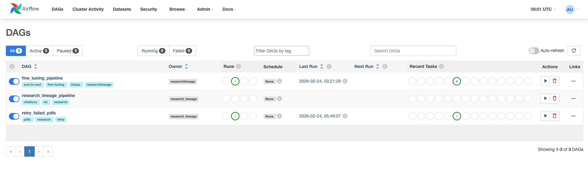
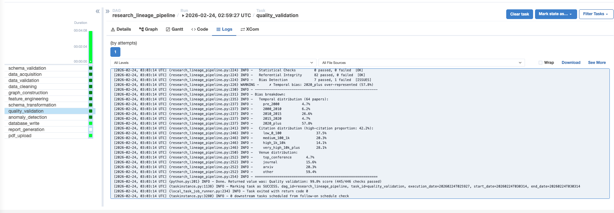
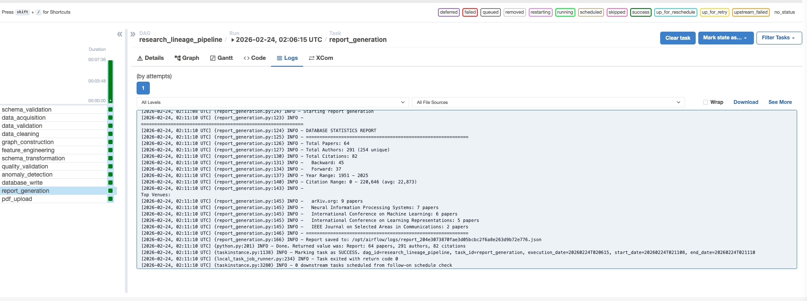
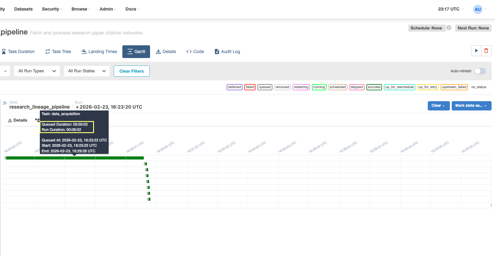
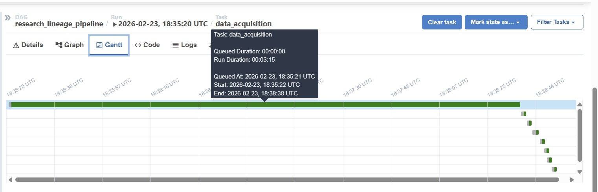
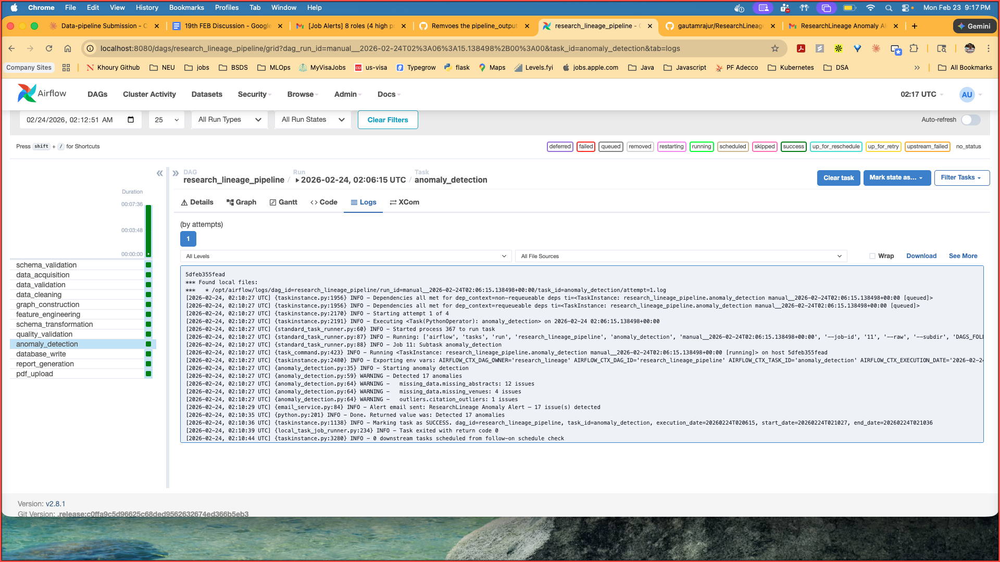
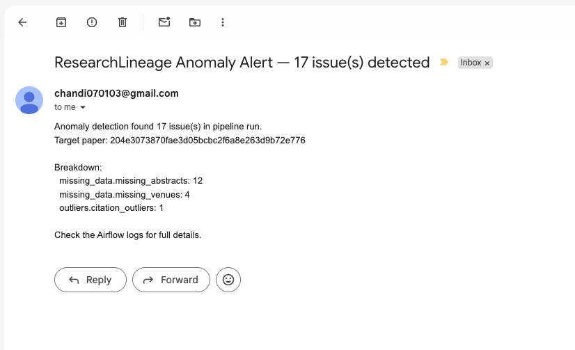

# ResearchLineage — LLM-Powered Research Lineage & Path Tracker

> *"We're not replacing comprehensive literature reviews. We're the Wikipedia of research lineages — a starting point that helps researchers get oriented 10x faster, so they can read the right papers in the right order with the right context."*

Given a seed paper ID, this pipeline crawls the Semantic Scholar citation graph, validates and cleans the data, builds a directed citation network, engineers influence features, detects anomalies, and writes structured results to a PostgreSQL database — all orchestrated by Apache Airflow running locally via Docker Compose, backed by GCP (Cloud SQL + GCS) and versioned with DVC. Three DAGs cover the full workflow: citation network analysis, fine-tuning data generation for Llama 3.1 8B, and a standalone PDF retry handler.

---

## Table of Contents

1. [Architecture](#architecture)
2. [Research Lineage UI](#research-lineage-ui)
3. [Data Acquisition](#data-acquisition)
4. [Data Preprocessing](#data-preprocessing)
5. [Schema & Statistics Generation](#schema--statistics-generation)
6. [Pipeline Flow Optimization](#pipeline-flow-optimization)
7. [Anomaly Detection & Alerting](#anomaly-detection--alerting)
8. [Bias Detection & Mitigation (DAG 2)](#bias-detection--mitigation-dag-2)
9. [Model Development (Fine-tuning & Evaluation)](#model-development-fine-tuning--evaluation)
10. [CI/CD Pipeline](#cicd-pipeline)
11. [Model Comparison & Selection](#model-comparison--selection)
12. [Experiment Tracking (MLflow)](#experiment-tracking-mlflow)
13. [Model Registry & Rollback](#model-registry--rollback)
14. [Notifications & Alerts](#notifications--alerts)
15. [Error Handling](#error-handling)
16. [Tracking & Logging](#tracking--logging)
17. [Monitoring & Drift Detection](#monitoring--drift-detection)
18. [Running Tests](#running-tests)
19. [Load Testing](#load-testing)
20. [Data Versioning (DVC)](#data-versioning-dvc)
21. [Project Structure](#project-structure)
22. [Prerequisites](#prerequisites)
23. [Setup & Reproducibility](#setup--reproducibility)
24. [Deploying to a New Environment](#deploying-to-a-new-environment)
25. [Running the Pipeline](#running-the-pipeline)
26. [Configuration Reference](#configuration-reference)

---

## Architecture

Three Airflow DAGs, all running locally via Docker Compose:

| DAG | Tasks | Operator | Trigger |
|---|---|---|---|
| `research_lineage_pipeline` | 11 + parallel pdf_upload | PythonOperator | Manual |
| `fine_tuning_pipeline` | 8 sequential | BashOperator | Manual |
| `retry_failed_pdfs` | 1 | PythonOperator | Manual |



### `research_lineage_pipeline` — 11-task flow

```
[T0]  schema_validation         — verify PostgreSQL tables exist
        ↓
[T1]  data_acquisition          — Semantic Scholar API crawl (async, depth-limited BFS)
        ↓                      ↘
[T2]  data_validation            [pdf_upload] → GCS   ← parallel branch, 120-min timeout
        ↓
[T3]  data_cleaning
        ↓
[T4]  citation_graph_construction
        ↓
[T5]  feature_engineering
        ↓
[T7]  schema_transformation
        ↓
[T8]  quality_validation         — 300–500 checks; ≥85% required
        ↓
[T9]  anomaly_detection          — Z-score > 3 outliers + email alert
        ↓
[T10] database_write             — upsert to Cloud SQL via Auth Proxy
        ↓
[T11] report_generation          — JSON stats report (papers, authors, citations, year range)
```

Inter-task data passes through Airflow **XCom**. The NetworkX graph is not serialised to XCom; only derived metrics are pushed downstream.

**Config:** `max_active_runs=1`, `retries=3`, `retry_delay=5m`, `execution_timeout=60m` (pdf_upload: 120m).

---

## Research Lineage UI

A full-stack web interface for exploring paper lineages interactively, backed by a FastAPI server and a Vite + React frontend.

### FastAPI Backend (`src/backend/`)

| Endpoint | Method | Purpose |
|---|---|---|
| `/health` | GET | Health check |
| `/search` | GET | Paper title search via Semantic Scholar (DB cache fallback) |
| `/analyze` | POST / GET | Run both views for a paper — returns tree + timeline JSON |
| `/chat` | POST | Stream a Gemini-powered chat response about the lineage (SSE) |
| `/feedback` | POST | Store anonymous predecessor-selection feedback |

The backend wraps `orchestrator.py`, which coordinates two views:
- **Evolution view** (`evolution_view/`) — Gemini-analyzed timeline chain from seed → foundational papers
- **Pred/Successor view** (`pred_successor_view/`) — bidirectional citation tree (ancestors + descendants)

Both views share a PostgreSQL-backed cache (`common/cache.py`) with a module-level connection pool.

```bash
uvicorn src.backend.api:app --reload --port 8000
```

### React Frontend (`src/frontend/`)

Built with Vite, React, TypeScript, Tailwind CSS, Framer Motion, and React Flow.

**Timeline View** — chronological chain from seed → foundational paper:
- Per-card sections: key innovation, problem addressed, core method, ELI5 / intuitive / technical explanations, limitations, secondary influences, abstract
- Comparison cards between each adjacent pair ("Improvement over predecessor") with predecessor-selection feedback
- Source type and breakthrough level badges with a collapsible badge guide (ⓘ) explaining each tag and its hallucination risk implication

**Predecessor / Successor Tree View** — interactive React Flow graph:
- Ancestors (blue) flow left → target; descendants (green) flow right
- Click any node to highlight its lineage path to the target; click canvas to reset
- Toggle ancestors / descendants independently
- Hover any node to reveal S2 and arXiv links (where available)

**Theme system** — 6 themes (Midnight, Slate, Ocean, Forest, Crimson, Dusk) selectable at runtime via `ThemePicker`.

**Gemini Chat Assistant** — collapsible sidebar panel:
- Full lineage context injected as a system prompt
- Streaming SSE response rendered word-by-word
- Suggested questions for quick entry
- Quota-exceeded and missing-timeline errors surfaced in plain language

```bash
cd src/frontend && npm install && npm run dev
# Vite proxies /api/* → http://localhost:8000
```

### User Feedback (Concept Drift Detection)

Each comparison card includes an anonymous thumbs up / down widget:

| Action | Behavior |
|---|---|
| 👍 Thumbs up | Submits immediately — predecessor selection confirmed correct |
| 👎 Thumbs down | Reveals optional comment field before submitting |

Feedback is stored in the `feedback` table (`paper_id`, `related_paper_id`, `view_type`, `feedback_target`, `rating`, `comment`, `created_at`) and can be queried to detect concept drift in Gemini's predecessor-selection decisions over time.

---

## Data Acquisition

**Sources:** Semantic Scholar (primary — metadata, citation intent, influence flags), arXiv (full-text HTML fallback), OpenAlex (API fallback when S2 rate-limits), Google Gemini (comparison pair generation, DAG 2 only).

**Three-layer caching:** Redis (48h TTL, ~60–70% hit) → PostgreSQL (permanent, ~20–30% hit) → live API. Combined live API miss rate: 10–20%.

**Inline filtering** runs before recursive BFS calls with the following criteria:
- Citation intent must be `methodology` or `background`, **or** the paper is marked `isInfluential` by Semantic Scholar
- Papers are scored: base citation count + **+10K** (influential) + **+5K** (methodology intent)
- Top N papers taken per depth level — adaptive: 5 at depth 0–1, 3 at depth 2, 2 at depth 3+

Result: **98% reduction in API calls** (10,000+ → 100–150 per run).

**Output:** JSONL with `instruction`, `prompt`, `response`, and `metadata` (paper IDs, years, citations, fields, depth, lineage chain). Supports `backward` / `forward` / `both` traversal. State file enables resume; fixed random seed ensures reproducibility.

---

## Data Preprocessing

### DAG 1 — Tasks 2–5

| Task | Key details |
|---|---|
| **T2 — Data Validation** | Schema, field presence, type/range checks; >10% error rate raises `ValidationError` and halts |
| **T3 — Data Cleaning** | Text normalisation, venue standardisation, deduplication, self-citation removal; ~80% of raw edges filtered |
| **T4 — Citation Graph** | NetworkX `DiGraph`; PageRank (α = 0.85), betweenness centrality, in/out-degree, connected components |
| **T5 — Feature Engineering** | Citation velocity, recency score, temporal category, years-from-target, composite influence score |

### DAG 2 — Preprocessing steps

- **preprocessing:** validates JSONL, drops malformed records
- **repair_lineage_chains:** reconstructs missing metadata via shared paper ID cross-reference
- **split + convert:** separates pairs from metadata sidecars; converts to Qwen 2.5-7B chat format

---

## Schema & Statistics Generation

The pipeline automates schema verification and statistics generation at three points:

**T0 — Schema Validation:** `SchemaValidationTask` verifies all required PostgreSQL tables exist before any data is fetched. Fails fast if the schema is missing or incomplete.

**T8 — Quality Validation:** `QualityValidationTask` runs 300–500 checks across schema compliance, statistical properties, referential integrity, and distribution balance. A score below **85%** raises `DataQualityError` and halts before writing to the database.



| Dimension | Check | Threshold |
|---|---|---|
| **Temporal** | No single era > 50% of papers | 5 eras: pre-2000, 2000–2010, 2010–2015, 2015–2020, 2020+ |
| **Citation** | Distribution across high/medium/low cited papers | Flags if >70% high-citation |
| **Venue** | No single venue type > 60% | top-conference, arXiv, journal |

**T11 — Report Generation:** After each successful run, `ReportGenerationTask` produces a JSON statistics report: total papers, authors, citations, papers-by-year, top venues, citation stats, year range.



---

## Pipeline Flow Optimization

**Inline filtering** cuts API calls from 10,000+ (~6 h hypothetical) to 100–150 per run (2–3 min) — 98% reduction.

**Parallelisation:** after `data_acquisition`, `pdf_upload` branches off concurrently (120-min timeout) without blocking the main chain.

**Gantt analysis** pinpointed `data_acquisition` as the bottleneck. After enabling caching + filtering: **6m 02s → 3m 15s (46% faster)**, with `database_write` no longer timing out. Steady state: <5 min e2e, 60–80% cache hit rate, 95%+ task success.

Below — pre-optimization Gantt showing `data_acquisition` at **6m 02s**:



After — `data_acquisition` down to **3m 15s** (46% faster), all downstream tasks finish in seconds:



---

## Anomaly Detection & Alerting

`AnomalyDetectionTask` (T9) detects the following anomaly types:

| Type | Detection method |
|---|---|
| Missing data (abstracts, years, venues) | Field presence check on every record |
| Statistical outliers (citation counts) | Z-score > 3 |
| Citation anomalies (self-citations, duplicates) | Post-cleaning verification pass |
| Disconnected papers (zero in/out degree) | Graph connectivity scan |
| API rate limit threshold breaches | Request counter threshold monitoring |

When `total_anomalies > 0`, an email alert is sent via `EmailService` (`src/utils/email_service.py`) — methods: `send_alert`, `send_pipeline_success`, `send_pipeline_error`.





**Sample alert:**

```
Subject: ResearchLineage Anomaly Alert — 5 issue(s) detected

Anomaly detection found 5 issue(s) in pipeline run.
Target paper: 204e3073870fae3d05bcbc2f6a8e263d9b72e776

Breakdown:
  missing_data.missing_abstracts: 2
  missing_data.missing_venues: 1
  citation_anomalies.duplicate_citations: 1
  disconnected_papers.disconnected_papers: 1

Check the Airflow logs for full details.
```

Alerts are **silently skipped** if SMTP credentials are not configured — the pipeline continues normally.

**Gmail setup:** Enable 2-Step Verification → generate an App Password at `myaccount.google.com/apppasswords` → use the 16-character code as `SMTP_PASSWORD`.

---

## Bias Detection & Mitigation (DAG 2)

> Applies **exclusively to `fine_tuning_pipeline`** (DAG 2). The main `research_lineage_pipeline` runs data quality validation at Task 8 — not bias mitigation.

Llama 3.1 8B is fine-tuned on ancestor paper selection and structured comparison generation. Naive random splitting inflates evaluation metrics because bibliometric signals and lineage graph overlap cause train/test leakage that sample-level deduplication cannot catch.

### Bias 1 — Shared Ancestor Overlap

Different seeds' lineage trees converge on shared papers (e.g. AlexNet, Transformer). A **union-find** algorithm clusters all samples that share any paper ID into the same split, preventing the model from exploiting memorised representations.

| Version | Samples | Clusters | Shared IDs (any split pair) |
|---|---|---|---|
| v1 | 184 | 94 | 0 |
| v2 | 293 | 163 | 0 |
| v3 | 392 | 259 | 0 |

### Bias 2 — Popularity Bias

Citation-based filtering risks a spurious popularity-relevance correlation. Citation counts are binned into five quantile tiers (`low / medium / high / very_high / landmark`) used as a stratification axis during splitting. All splits verified within **±7 pp** of the overall tier distribution across all versions.

### Bias 3 — Domain Imbalance

Unconstrained seed selection yields ~65% CS. Three rounds of targeted seed collection rebalanced the corpus:

| Field | v1 (184) | v2 (293) | v3 (392) |
|---|---|---|---|
| Computer Science | 66.8% | 57.7% | 50.5% |
| Physics | 19.0% | 27.0% | 34.9% |
| Mathematics | 14.1% | 15.3% | 14.6% |

Splits use composite keys (domain × tier) to stay within **±5 pp** per field. Math remains underrepresented (~15%) due to sparse S2 coverage — future work includes zbMATH/MathSciNet and lower citation thresholds for math seeds.

CS being over-represented at ~50% is considered an **acceptable structural compromise**: CS algorithms inherently form longer, more densely linked citation chains than physics or math papers, so naive seed sampling will always skew toward CS. Three rounds of targeted rebalancing brought it from 66% → 50%, which is meaningful progress. Rather than force further undersampling now — which would discard valid training signal and inflate fine-tuning cost — the plan is to evaluate model performance across domain slices after fine-tuning and apply corrective resampling only if cross-domain performance gaps are significant.

### Splitting Procedure

1. **Cluster formation** — union-find on shared paper IDs
2. **Cluster profiling** — dominant field, popularity tier, max year, size
3. **Stratified allocation** — composite key (domain × tier), temporal ordering, 70/15/15
4. **Integrity verification** — zero cross-split paper ID overlap confirmed

---

## Model Development (Fine-tuning & Evaluation)

### Fine-tuning — Qwen 2.5-7B on Modal

| Parameter | Value |
|---|---|
| Base model | `Qwen/Qwen2.5-7B-Instruct` |
| Hardware | Modal A100 GPU |
| Method | LoRA (`r=16`, `alpha=16`, `max_seq_length=8192`) |
| Training data | Research citation pairs in Qwen chat format (`data/tasks/pipeline_output/qwen_format/`) |
| Output | Adapter weights → `gs://researchlineage-gcs/models/trained/<version>/` |

```bash
modal run scripts/modal_train.py
```

**Why LoRA?** Full fine-tuning a 7B model requires ~80 GB VRAM. LoRA (r=16) achieves comparable task-specific adaptation with ~4 GB of trainable parameters on a single A100.

### Evaluation

Each model is scored on 101 test samples across three steps: `run_inference` → `evaluate` → `bias_check`.

| Metric | Description |
|---|---|
| `predecessor_strict` | Exact match — did the model identify the correct predecessor? |
| `predecessor_soft` | Soft match — correct predecessor OR a valid secondary influence |
| `mrr` | Mean Reciprocal Rank of the correct predecessor in the model's output |
| `secondary_f1` | F1 score for secondary influence identification |
| `judge_overall` | Mean LLM-as-judge score across 5 reasoning dimensions (1–5 scale, Gemini Flash) |

**Bias check** flags domain disparity (CS / Physics / Math) and citation-tier disparity exceeding a 0.15 threshold.

### Latest Results (101 samples)

| Model | Predecessor Soft | Judge Overall | Composite |
|---|---|---|---|
| **Gemini 2.5 Flash** | 0.856 | 3.84 | **0.785** |
| Qwen 2.5-7B Fine-tuned | 0.776 | 3.09 | **0.736** |

Gap: **0.05** — meaningful given the 7B model runs locally vs a frontier API.

**Why compare against Gemini?** Gemini 2.5 Flash serves as the zero-shot baseline. A fine-tuned 7B scoring within 0.05 composite validates that the fine-tuning signal is meaningful.

### Airflow DAGs

| DAG | File | Purpose |
|---|---|---|
| `training_dag` | `dags/training_dag.py` | Modal training → MLflow log → GCS register |
| `evaluate_performance` | `dags/evaluate_performance.py` | Inference + judge scoring + bias check + notify |
| `compare_models` | `dags/compare_models.py` | Parallel eval → selection → visualization → notify |

### Key Scripts

| Script / File | Purpose |
|---|---|
| `scripts/modal_train.py` | LoRA fine-tuning on Modal A100 |
| `scripts/modal_serve.py` | vLLM serving on Modal |
| `src/tasks/evaluation_task.py` | Inference, judge scoring, bias check (3-step CLI) |
| `src/tasks/model_selection_task.py` | Composite scoring, winner selection, visualization |
| `src/mlflow_utils.py` | MLflow log helpers for training, evaluation, comparison |

---

## CI/CD Pipeline

Six GitHub Actions workflows automate testing, training, evaluation, model comparison, deployment, and rollback.

### Workflows

| Workflow | File | Trigger | Purpose |
|---|---|---|---|
| **CI** | `ci.yml` | Push to any branch, PR to main | Lint (ruff), typecheck (mypy), unit tests (pytest), DAG validation |
| **Model Training** | `model-training.yml` | Manual dispatch | Train on Modal (A100), log to MLflow, register model, trigger comparison |
| **Model Comparison** | `model-comparison.yml` | Called by training, manual dispatch | Evaluate multiple models in parallel, select best, generate visualizations |
| **Model Evaluation** | `model-evaluation.yml` | Manual dispatch, eval code changes to main | Single-model inference + LLM judge scoring, threshold gates, bias check |
| **Deploy** | `deploy.yml` | Manual dispatch | Deploy to Modal (vLLM serving), smoke test, update pipeline state on GCS |
| **Rollback** | `rollback.yml` | Manual dispatch | Roll back to a previous model version, redeploy, notify via email |

### CI Pipeline (`ci.yml`)

Runs on every push and PR:

```
lint (ruff check) ──┐
typecheck (mypy)  ──┤
test (pytest)     ──┼──→ notify (email, on failure only)
dag-validation    ──┘
```

- **527 tests** across unit and integration suites
- DAG validation uses AST parsing to verify syntax without importing Airflow
- Failure notifications sent via email using `scripts/notify.py`

### Model Training → Comparison → Deploy Flow

```
model-training.yml                          deploy.yml
┌──────────────────────────────┐           ┌──────────────────────┐
│ train (Modal A100)           │           │ deploy (Modal vLLM)  │
│        ↓                     │           │        ↓             │
│ log-mlflow    model-compare ─┼─calls──→  │ smoke-test           │
│        ↓      (parallel eval │ model-    │        ↓             │
│ register       → select      │ comp.yml  │ update-state (GCS)   │
│ (GCS registry) → visualize)  │           └──────────────────────┘
└──────────────────────────────┘
```

### Evaluation Gates

The evaluation workflow enforces quality thresholds before a model can be promoted:

| Gate | Metric | Threshold |
|---|---|---|
| **Classification** | `predecessor_strict` accuracy | ≥ 0.60 |
| **LLM Judge** | `judge_overall` mean score | ≥ 3.0 / 5.0 |
| **Bias** | Max disparity across domain/popularity slices | ≤ 0.15 |

Scoring formula: `Score = 0.75 * Predecessor_soft + (Judge_overall / 5) * 0.25`

### PR Validation Mode

On pull requests, the training, evaluation, and deploy workflows run in **validation mode**:

- **Training**: Skips actual Modal training; validates workflow structure and output wiring
- **Evaluation**: Downloads existing evaluation artifacts from GCS instead of running live inference; threshold and bias gates still execute against real results
- **Deploy**: Skips Modal deployment; verifies required scripts exist and workflow structure is correct

This allows full pipeline verification without incurring GPU costs or long training runs.

---

## Model Comparison & Selection

Multi-model evaluation pipeline that compares candidate models, selects the best one using a composite scoring formula, and generates visualization reports.

### Models Compared

| Model | Endpoint Type | Client |
|---|---|---|
| **Qwen 2.5-7B Fine-tuned** | Modal simple POST | `ModalClient` |
| **Gemini 2.5 Pro** | Vertex AI managed API | `GeminiClient` |

Additional models can be added by passing different `--model-endpoint` values. The client is auto-selected based on the endpoint format:
- `gemini-*` → `GeminiClient` (Vertex AI)
- `http*` ending in `/v1` → `OpenAICompatibleClient` (vLLM / OpenAI-compatible)
- `http*` → `ModalClient` (Modal web endpoint)
- Anything else → `VertexAIClient` (Vertex AI endpoint ID)

### Selection Formula

```
Composite Score = 0.75 * predecessor_soft + (judge_overall / 5) * 0.25
```

- **predecessor_soft** (75% weight): Whether the model correctly identifies the methodological predecessor of a paper (with soft matching against secondary influences)
- **judge_overall** (25% weight): Mean LLM judge score (1-5 scale) across 5 reasoning dimensions, normalized to 0-1

### How It Works

```
┌──→ eval_model_a (inference → judge scoring) ──┐
│                                                ├──→ model_selection → visualization → upload (GCS)
└──→ eval_model_b (inference → judge scoring) ──┘
```

1. **Parallel evaluation** — Each model runs inference on the same test set, then an LLM judge (Gemini Flash) scores outputs
2. **Selection** — `model_selection.py` computes composite scores and picks the winner
3. **Visualization** — Generates bar charts, radar plots, per-domain/tier comparisons, and a self-contained HTML report
4. **Logging** — Per-model metrics, rankings, and chart artifacts logged to MLflow
5. **Promotion** — Winner is compared against current production model; promoted if it scores higher

### Output Artifacts

| Artifact | Location | Description |
|---|---|---|
| `model_selection_report.json` | GCS + MLflow | Winner, scores, rankings, formula |
| `comparison_bar.png` | GCS + MLflow | Side-by-side bar chart of all metrics |
| `comparison_radar.png` | GCS + MLflow | Spider chart across key metrics |
| `comparison_by_domain.png` | GCS + MLflow | Per-domain grouped bar chart |
| `comparison_by_tier.png` | GCS + MLflow | Per-citation-tier grouped bar chart |
| `model_comparison.html` | GCS + MLflow | Self-contained HTML report with embedded charts |

All artifacts are stored at `gs://researchlineage-gcs/fine-tuning-artifacts/model_comparison/`.

### Airflow DAG

The `compare_models` DAG (`dags/compare_models.py`) orchestrates parallel evaluation with TaskGroups:

```
eval_model_a ──┐
eval_model_b ──┼──→ model_selection ──→ upload_comparison
eval_model_c ──┘
```

Each eval group runs: `run_inference` → `evaluate`. Model endpoints and names are configurable via DAG params.

### CLI Usage

```bash
# Run comparison against existing evaluation reports
python src/tasks/model_selection_task.py \
  --report-dirs /tmp/eval_qwen7b /tmp/eval_gemini \
  --model-names qwen-7b-finetuned gemini-2.5-pro \
  --output-dir /tmp/model_comparison \
  --generate-viz \
  --promote \
  --upload
```

### Key Files

| File | Purpose |
|---|---|
| `src/evaluation/model_selection.py` | Composite scoring, model ranking, legacy format adapter |
| `src/evaluation/visualization.py` | Chart generation (matplotlib) + HTML report |
| `src/evaluation/model_client.py` | Client factory for Gemini, Modal, OpenAI-compatible, VertexAI |
| `src/tasks/model_selection_task.py` | CLI wrapper: select → visualize → MLflow → promote → upload |
| `dags/compare_models.py` | Airflow DAG for parallel multi-model evaluation |
| `.github/workflows/model-comparison.yml` | CI/CD workflow (PR: cached artifacts, main: real inference) |

### Required GitHub Secrets

| Secret | Description |
|---|---|
| `GCP_SA_KEY` | GCP service account key JSON |
| `GCP_PROJECT_ID` | GCP project ID |
| `GCS_BUCKET_NAME` | GCS bucket (e.g. `researchlineage-gcs`) |
| `MODAL_TOKEN_ID` | Modal authentication token ID |
| `MODAL_TOKEN_SECRET` | Modal authentication token secret |
| `MLFLOW_TRACKING_URI` | MLflow server URI |
| `EVAL_GCS_TEST_PATH` | GCS path to evaluation test data |
| `EVAL_MODEL_ENDPOINT` | Model endpoint for evaluation (gemini-* or Modal URL) |
| `SMTP_HOST` / `SMTP_PORT` / `SMTP_USER` / `SMTP_PASSWORD` | SMTP config for email notifications |
| `ALERT_EMAIL_FROM` / `ALERT_EMAIL_TO` | Email sender/recipient for alerts |

---

## Experiment Tracking (MLflow)

MLflow tracks all training runs, evaluation results, and model versions.

### Setup

MLflow runs as part of the Docker Compose stack:

```yaml
# docker-compose.yml adds:
mlflow-db:    # Postgres 15 backend (port 5434)
mlflow:       # MLflow server (port 5001, artifact root: gs://researchlineage-gcs/mlflow-artifacts)
```

Access the UI at http://localhost:5001 after `docker compose up`.

### What gets logged

| Event | Logged data |
|---|---|
| **Training run** | LoRA params (r=16, alpha=16), base model, epochs, learning rate, max_seq_length, model GCS URI |
| **Evaluation run** | Classification accuracy, judge scores, semantic similarity, per-slice metrics |
| **Bias report** | Domain/popularity slice metrics, max disparity, pass/fail status |
| **Model comparison** | Per-model composite scores, winner selection, rankings, visualization charts (PNG + HTML) |

### Integration points

- `src/mlflow_utils.py` — helper functions (`log_training_run`, `log_evaluation_run`, `log_bias_report`, `log_model_comparison`, `register_model`)
- `dags/training_dag.py` — `log_to_mlflow` task runs after training
- `src/evaluation/pipeline.py` — logs metrics in `save_results()` (graceful skip if MLflow unavailable)
- GitHub Actions — model-training workflow logs to MLflow after each run

---

## Model Registry & Rollback

### GCS-based Model Registry

Models are registered in GCS with versioned metadata:

```
gs://researchlineage-gcs/model-registry/
  └── researchlineage-model/
      ├── v20260320_143000/
      │   └── metadata.json    # version, GCS URI, stage, timestamp
      └── v20260315_091500/
          └── metadata.json
```

- `src/registry/artifact_registry.py` — `push_model_to_registry()`, `list_model_versions()`, `promote_model()`
- Models are also registered in MLflow Model Registry for experiment lineage

### Rollback

`rollback.yml` (manual dispatch) rolls back to any previous model version:

1. Updates `pipeline_state.json` on GCS with the target version
2. Redeploys the target model to Modal (vLLM serving)
3. Sends email notification with rollback status

Programmatic rollback: `src/registry/rollback.py` — `rollback_model()`, `get_rollback_candidates()`

---

## Notifications & Alerts

Email notifications are sent via SMTP for pipeline failures, training completion, model validation results, and bias check outcomes. All notifications use `scripts/notify.py` — a CLI wrapper around `src/utils/email_service.py`.

### Coverage

| Pipeline | Event | When |
|---|---|---|
| **CI** (`ci.yml`) | Lint / typecheck / test / DAG validation failure | Any job fails |
| **Model Training** (`model-training.yml`) | Training complete or failed | Always (after train + log + register) |
| **Model Evaluation** (`model-evaluation.yml`) | Threshold gate or bias check failure | Step fails |
| **Model Evaluation** (`model-evaluation.yml`) | All evaluation gates passed | All steps succeed |
| **Model Comparison** (`model-comparison.yml`) | Selection results (winner + promoted status) | Always (after eval + selection) |
| **Deploy** (`deploy.yml`) | Deploy success or failure (includes smoke test) | Always (after deploy + smoke + state) |
| **Rollback** (`rollback.yml`) | Rollback result | Always |
| **Airflow: compare_models** | Comparison complete or failed | `trigger_rule: all_success` / `one_failed` |
| **Airflow: evaluate_performance** | Evaluation complete or failed | `trigger_rule: all_success` / `one_failed` |
| **Airflow: research_lineage_pipeline** | Anomaly detection alerts (T9) | Anomalies detected |

### How It Works

All CI/CD notifications call the same script:

```bash
python scripts/notify.py \
  --channel email \
  --event "Training Complete" \
  --status success \
  --details "Model version: v20260324 | All steps passed"
```

The script reads SMTP credentials from environment variables and sends a formatted email via `EmailService`. If SMTP is not configured, the notification is silently skipped — the pipeline continues normally.

Airflow DAGs use `BashOperator` tasks with `trigger_rule`:
- `notify_success` — runs only when all upstream tasks succeed (`all_success`)
- `notify_failure` — runs when any upstream task fails (`one_failed`)

### Required Secrets (GitHub Actions)

| Secret | Description |
|---|---|
| `SMTP_HOST` | SMTP server (default: `smtp.gmail.com`) |
| `SMTP_PORT` | SMTP port (default: `587`) |
| `SMTP_USER` | SMTP login (e.g. Gmail address) |
| `SMTP_PASSWORD` | SMTP password (Gmail App Password) |
| `ALERT_EMAIL_FROM` | Sender email address |
| `ALERT_EMAIL_TO` | Recipient email address |

For Airflow, set these as environment variables in `.env` or `docker-compose.yml`.

### Gmail Setup

1. Enable **2-Step Verification** on your Google account
2. Go to `myaccount.google.com/apppasswords`
3. Generate a 16-character App Password
4. Use it as `SMTP_PASSWORD`

### Testing Notifications via PR

Push to the `feature/cicd-pipeline` branch (or any branch with an open PR to `main`). The workflows run in **validation mode** — no GPU costs, no live inference — but the notification steps still execute. If SMTP secrets are configured in the repo, you will receive emails for:

- CI pass/fail
- Model comparison selection results
- Evaluation threshold/bias gate results
- Training workflow completion

If SMTP secrets are **not** configured, the notification steps log "Email not configured, skipping" and the workflow still passes.

### Key Files

| File | Purpose |
|---|---|
| `scripts/notify.py` | CLI entry point — supports `--channel email/slack/both` |
| `src/utils/email_service.py` | `EmailService` class with SMTP send logic |
| `src/utils/email_templates.py` | HTML email templates with alert levels (INFO, WARNING, ERROR, SUCCESS) |

---

## Error Handling

Each task raises typed exceptions from `src/utils/errors.py`:

| Exception | Raised by | Condition |
|---|---|---|
| `ValidationError` | T1, T2 | Missing required fields, invalid types, >10% error rate |
| `DataQualityError` | T8 | Quality score below 85% threshold |
| `APIError` | T1 | Semantic Scholar / OpenAlex request failure |
| `RateLimitError` | T1 | API rate limit exceeded (429) |

**Graceful degradation:** Redis down → API-only; DB down → API fallback; rate limited → linear backoff (10 retries, up to 275 s); partial API failures → logged and skipped; SMTP absent → alerts silently skipped; PDF 403/404 → removed from retry queue.

---

## Tracking & Logging

All logging is centralised through `src/utils/logging.py`. Every module uses the same entry point:

```python
from src.utils.logging import get_logger
logger = get_logger(__name__)
```

Logs are routed differently depending on the runtime environment:

| Environment | Handler | Viewer |
|---|---|---|
| Cloud Run (production) | Structured JSON to stdout | GCP Cloud Logging (fields indexed: `level`, `logger`, `paper_id`) |
| Docker / Airflow (local) | NDJSON to file + Filebeat | Kibana at http://localhost:5601 |
| Local dev | Plain text to stdout | Terminal |

`LOG_LEVEL` in `.env` controls verbosity (default: `INFO`; set to `DEBUG` for verbose output).

**DAG 1** logs per-task progress, validation results, and cache hit rates via Airflow task logs.

**DAG 2** writes dual output: `INFO`+ to Airflow logs and a full `DEBUG`-level trace to `data/tasks/pipeline_output/pipeline.log`.

### ELK Stack (Elasticsearch + Kibana + Filebeat)

Filebeat ships log lines from `logs/app/researchlineage.jsonl` to Elasticsearch. Elasticsearch and Kibana run as Docker Compose services alongside the main stack.

```bash
# Start ELK services (can be added to the main compose up)
docker compose up elasticsearch kibana filebeat -d
```

Import the pre-built Kibana saved objects (dashboards, index patterns, visualizations):

```bash
./scripts/setup_kibana.sh         # defaults to http://localhost:5601
./scripts/setup_kibana.sh http://your-kibana-host:5601   # custom URL
```

Kibana is available at http://localhost:5601. Navigate to **Dashboards** to view the Centralized Log Management dashboard: log level histogram, error count over time, module breakdown, and full log table.

---

## Monitoring & Drift Detection

Two Kibana dashboards track model health over time by syncing live data from Cloud SQL and user feedback into Elasticsearch.

### Data Drift

Compares the training data snapshot (from GCS) against the current live lineage data in Cloud SQL. Differences in citation counts, year distributions, and domain coverage indicate whether the live data has drifted from what the model was trained on.

```bash
# Sync training snapshot + live data to Elasticsearch
python scripts/sync_finetuning_elasticsearch.py
```

This populates two indices:
- `rl-finetuning-snapshot` - static training snapshot from `gs://researchlineage-gcs/`
- `rl-finetuning-live` - current state from Cloud SQL (full-refreshed on each run)

The Data Drift dashboard in Kibana overlays both indices to surface divergence.

### Concept Drift

Tracks user predecessor-selection feedback (thumbs up / down) over time. A shift in the thumbs-down rate signals that Gemini's predecessor decisions are drifting from what users consider correct.

```bash
# Sync feedback table from Cloud SQL to Elasticsearch
python scripts/sync_feedback_elasticsearch.py
```

This populates the `rl-feedback` index with a derived `sentiment` field (`positive` / `negative` / `unknown`). The Concept Drift dashboard in Kibana shows sentiment trends, paper-level breakdown, and comment text.

Both scripts require Cloud SQL Auth Proxy running locally and Elasticsearch reachable. See [Configuration Reference](#configuration-reference) for the required env vars (`ELASTICSEARCH_HOST`, `ELASTICSEARCH_PORT`, `CLOUD_SQL_*`).

---

## Running Tests

Tests are fully isolated — no live API calls, no database connections required.

### Option A: Docker (recommended)

```bash
docker build -f Dockerfile.test -t researchlineage-tests .
docker run --rm -v $(pwd)/reports:/app/reports researchlineage-tests
```

Open `reports/report.html` for the full results dashboard.

Expected result: **527 passed**

The warning is a harmless Pydantic v2 deprecation in `src/utils/config.py` — does not affect functionality.

### Option B: Local

```bash
poetry run pytest tests/ -v
```

### Test coverage

| File | Tests | Scope |
|---|---|---|
| `test_data_acquisition.py` | 29 | Input/output validation, reference/citation filtering logic |
| `test_data_validation.py` | 21 | Schema checks, 10% error-rate threshold, self-citation removal |
| `test_data_cleaning.py` | 18 | Deduplication, venue normalisation, referential filtering |
| `test_citation_graph.py` | 18 | Graph construction, metrics, edge cases (empty graph) |
| `test_feature_engineering.py` | 16 | Feature completeness, normalisation, temporal categories |
| `test_schema_transformation.py` | 17 | Field mapping, ArXiv ID extraction, author UUID fallback |
| `test_quality_validation.py` | 21 | Quality checks, referential integrity, 85% quality threshold |
| `test_anomaly_detection.py` | 14 | Z-score outliers, duplicates, disconnected nodes |
| `test_pipeline_e2e.py` | 18 | Full Tasks 2–9 chain, data integrity across stages |
| **Total** | **171** | 153 unit + 18 integration |

---

## Load Testing

Load tests live in `load_tests/` and are driven by `Locustfile.py` at the project root.

The test simulates realistic API traffic against two endpoints:

| Endpoint | Weight | Notes |
|---|---|---|
| `GET /analyze/{paper_id}` | 7 | Cached paper IDs only |
| `POST /chat` | 3 | Random question from a fixed set |

Users wait 0.5-1 second between requests. The pre-run HTML report is at `load_tests/report.html` - open it in a browser to view throughput, response times, and failure rates from the last recorded run.

To run a new load test against a live backend:

```bash
pip install locust
locust -f Locustfile.py --host https://your-backend-url --headless -u 50 -r 5 --run-time 60s --html load_tests/report.html
```

Or use the Locust web UI:

```bash
locust -f Locustfile.py --host https://your-backend-url
# open http://localhost:8089
```

---

## Data Versioning (DVC)

DVC tracks raw/processed research data and fine-tuning artifacts. All data is stored in GCS. The remote is pre-configured in `.dvc/config` — no additional setup required.

### Remote

```
gs://researchlineage-gcs/dvc-store
```

Authentication uses the same GCP credentials as the rest of the project (`GCLOUD_CONFIG_DIR`).

### Tracked datasets

| DVC pointer | DAG | Contents |
|---|---|---|
| `data/raw.dvc` | `research_lineage_pipeline` | Raw API responses from Semantic Scholar |
| `data/processed.dvc` | `research_lineage_pipeline` | Cleaned, validated, and feature-engineered datasets |
| `data/tasks/pipeline_output/splits.dvc` | `fine_tuning_data_pipeline` | Stratified train / val / test splits (70 / 15 / 15) |
| `data/tasks/pipeline_output/qwen_format.dvc` | `fine_tuning_data_pipeline` | Qwen chat-format training files and metadata sidecars |

`.dvc` pointer files are committed to Git; actual data is not.

### Pull existing data

```bash
dvc pull
```

### Push new data after a pipeline run

> **Note:** Both DAGs automatically upload artifacts to GCS under a timestamped path (`{gcs_prefix}/{run_id}/`) at the end of each run. This is independent of DVC. The steps below are a **manual post-run step** to create a reproducible, git-linked snapshot restorable with `dvc pull`.

**Research lineage pipeline:**

```bash
dvc add data/raw data/processed
dvc push
git add data/raw.dvc data/processed.dvc
git commit -m "Update research lineage datasets"
```

**Fine-tuning pipeline:**

```bash
dvc add data/tasks/pipeline_output/splits data/tasks/pipeline_output/qwen_format
dvc push
git add data/tasks/pipeline_output/splits.dvc data/tasks/pipeline_output/qwen_format.dvc
git commit -m "Track fine-tuning artifacts from pipeline run"
```

### Retrieve data from a specific past run

```bash
git log --oneline data/raw.dvc
git checkout <commit-hash> -- data/raw.dvc
dvc pull data/raw.dvc
```

---

## Project Structure

```
.
├── .github/
│   └── workflows/
│       ├── ci.yml                     # Lint, typecheck, test, DAG validation
│       ├── model-training.yml         # Modal training → MLflow → registry → notify
│       ├── model-comparison.yml       # Multi-model eval → selection → notify
│       ├── model-evaluation.yml       # Inference + judge scoring + bias gates → notify
│       ├── deploy.yml                 # Modal deploy + smoke test + state update → notify
│       └── rollback.yml               # Rollback to previous model version → notify
│
├── dags/
│   ├── research_lineage_pipeline.py   # Main 11-task citation pipeline DAG
│   ├── fine_tuning_data_pipeline.py   # Fine-tuning data generation DAG (8 BashOperator tasks)
│   ├── training_dag.py               # Model training DAG (Modal + MLflow logging)
│   ├── evaluate_performance.py        # Evaluation DAG (inference + judge + bias + notify)
│   ├── compare_models.py             # Multi-model comparison DAG (parallel eval + select + notify)
│   └── retry_failed_pdfs_dag.py       # Standalone PDF retry DAG
│
├── src/
│   ├── backend/                       # FastAPI server + both lineage views
│   │   ├── api.py                     # FastAPI app — /search /analyze /chat /feedback
│   │   ├── orchestrator.py            # Runs pred_successor + evolution views together
│   │   ├── common/
│   │   │   ├── cache.py               # PostgreSQL cache (connection pool, all tables)
│   │   │   ├── config.py              # S2/Gemini/DB config + field sets
│   │   │   └── s2_client.py           # Semantic Scholar API client with retry/backoff
│   │   ├── pred_successor_view/
│   │   │   └── builder.py             # Builds ancestor + descendant citation tree
│   │   └── evolution_view/
│   │       ├── pipeline.py            # Gemini-driven lineage chain construction
│   │       ├── gemini_analysis.py     # Per-paper analysis + comparison generation
│   │       ├── text_extraction.py     # PDF / abstract text extraction
│   │       └── prompts/               # Versioned Gemini prompt templates
│   ├── frontend/                      # Vite + React + TypeScript UI
│   │   └── src/
│   │       ├── App.tsx                # Root — search → analyze → results routing
│   │       ├── components/
│   │       │   ├── TimelineView.tsx   # Evolution view — timeline cards, badge guide, feedback
│   │       │   ├── TreeView.tsx       # Pred/successor React Flow graph with filters
│   │       │   ├── ChatPanel.tsx      # Gemini chat sidebar (streaming SSE)
│   │       │   ├── nodes/
│   │       │   │   ├── PaperNode.tsx  # Ancestor/descendant node with hover S2/arXiv links
│   │       │   │   └── SeedNode.tsx   # Target paper node with hover S2/arXiv links
│   │       │   ├── HeroSearch.tsx     # Paper search with autocomplete
│   │       │   ├── ResultsPage.tsx    # Tab switcher: Timeline / Tree
│   │       │   ├── Header.tsx         # Top navigation bar
│   │       │   └── ThemePicker.tsx    # 6-theme selector
│   │       └── lib/
│   │           ├── api.ts             # Typed fetch wrappers for all backend endpoints
│   │           ├── types.ts           # Shared TypeScript types (mirrors backend schemas)
│   │           ├── theme.ts           # Theme definitions (Midnight/Slate/Ocean/Forest/…)
│   │           └── utils.ts           # Formatting helpers
│   ├── api/
│   │   ├── semantic_scholar.py        # Async S2 client with retry/backoff
│   │   ├── openalex.py                # OpenAlex enrichment client
│   │   └── base.py                    # Base HTTP client
│   ├── cache/
│   │   └── redis_client.py            # Redis-based request cache (TTL=48h)
│   ├── database/
│   │   ├── connection.py              # SQLAlchemy engine + session factory
│   │   └── repositories.py            # Upsert helpers for each table
│   ├── evaluation/
│   │   ├── pipeline.py                # Eval pipeline + slice_and_report() bias analysis
│   │   ├── config.py                  # Evaluation config
│   │   ├── types.py                   # Evaluation types
│   │   ├── model_client.py            # Model inference client
│   │   ├── model_selection.py        # Composite scoring + model ranking
│   │   ├── visualization.py          # Comparison charts (matplotlib) + HTML report
│   │   └── gcs_utils.py              # GCS helpers for eval artifacts
│   ├── registry/
│   │   ├── artifact_registry.py       # GCS-based model registry (push, list, promote)
│   │   └── rollback.py                # Model rollback + pipeline state management
│   ├── tasks/                         # One class per pipeline task
│   │   ├── schema_validation.py       # T0 — DB schema existence check
│   │   ├── data_acquisition.py        # T1 — async BFS crawl
│   │   ├── data_validation.py         # T2 — schema + type validation
│   │   ├── data_cleaning.py           # T3 — dedup, normalise
│   │   ├── citation_graph_construction.py  # T4 — NetworkX graph
│   │   ├── feature_engineering.py     # T5 — derived features
│   │   ├── schema_transformation.py   # T7 — flatten to tables
│   │   ├── quality_validation.py      # T8 — 300–500 quality checks + data-level bias
│   │   ├── anomaly_detection.py       # T9 — statistical anomaly detection + email alert
│   │   ├── database_write.py          # T10 — PostgreSQL upsert
│   │   ├── report_generation.py       # T11 — JSON statistics report
│   │   ├── evaluation_task.py         # Evaluation step runner (inference, evaluate, bias_check)
│   │   ├── model_selection_task.py   # Model selection CLI (select → viz → MLflow → promote)
│   │   ├── pdf_upload_task.py         # Parallel branch — fetch + GCS upload
│   │   ├── retry_failed_pdfs_task.py  # DAG 3 — retry failed PDF fetches
│   │   └── lineage_pipeline.py        # Fine-tuning pipeline step runner (DAG 2)
│   ├── mlflow_utils.py                # MLflow helpers (log runs, register models)
│   └── utils/
│       ├── config.py                  # Pydantic BaseSettings (reads .env)
│       ├── errors.py                  # ValidationError, DataQualityError, APIError
│       ├── id_mapper.py               # S2 ↔ ArXiv ID mapping
│       ├── logging.py                 # Centralised logging — single get_logger entry point
│       ├── email_service.py           # SMTP email alert service
│       └── email_templates.py        # HTML email templates with alert levels
│
├── scripts/
│   ├── modal_train.py                 # Modal training script (Qwen2.5-7B + LoRA on A100)
│   ├── modal_serve.py                 # Modal serving script (vLLM)
│   ├── validate_dags.py               # AST-based DAG syntax validator
│   └── notify.py                      # CLI for Slack/email pipeline notifications
│
├── tests/
│   ├── conftest.py                    # Shared factory helpers (make_paper, make_ref, make_cit)
│   ├── unit/
│   │   ├── conftest.py                # Per-task input fixtures
│   │   ├── test_data_acquisition.py   # 29 tests
│   │   ├── test_data_validation.py    # 21 tests
│   │   ├── test_data_cleaning.py      # 18 tests
│   │   ├── test_citation_graph.py     # 18 tests
│   │   ├── test_feature_engineering.py  # 16 tests
│   │   ├── test_schema_transformation.py # 17 tests
│   │   ├── test_quality_validation.py # 21 tests
│   │   ├── test_anomaly_detection.py  # 14 tests
│   │   ├── test_mlflow_utils.py       # MLflow integration tests (mocked)
│   │   └── test_registry.py           # Model registry tests (mocked)
│   └── integration/
│       ├── conftest.py                # Full pipeline chain fixture (Tasks 2–9, no live APIs)
│       └── test_pipeline_e2e.py       # 18 end-to-end tests
│
├── data/
│   ├── raw.dvc                            # DVC pointer — raw Semantic Scholar responses
│   ├── processed.dvc                      # DVC pointer — cleaned & feature-engineered data
│   └── tasks/
│       └── pipeline_output/               # Fine-tuning DAG runtime output (git-ignored)
│           ├── splits.dvc                 # DVC pointer — train/val/test splits
│           └── qwen_format.dvc           # DVC pointer — Qwen chat-format training files
│
├── logs/                              # Execution logs and pipeline reports
├── docker/
│   └── airflow.Dockerfile             # Airflow image with project deps + MLflow
├── Dockerfile.test                    # Test image (ruff + mypy + DAG validation + pytest)
├── docker-compose.yml                 # Postgres + Redis + Cloud SQL Proxy + Airflow + MLflow
├── pyproject.toml                     # Dependencies (Poetry) + pytest/ruff/mypy config
├── .env.example                       # Template for all required environment variables
├── .pre-commit-config.yaml            # PEP 8 enforcement (black, ruff, isort)
└── .dvc/                              # DVC remote config (GCS)
```

---

## Prerequisites

| Tool | Version | Purpose |
|---|---|---|
| Docker Desktop | ≥ 4.x | Running all services |
| Docker Compose | ≥ v2 | Orchestrating containers |
| Python | 3.11.x | Local development / test runs |
| Poetry | ≥ 2.0 | Dependency management |
| DVC | ≥ 3.x | Data versioning |
| GCP account | — | Cloud SQL + GCS (production only) |

---

## Setup & Reproducibility

### 1. Clone and configure environment

```bash
git clone https://github.com/gautamrajur/ResearchLineage.git
cd ResearchLineage

cp .env.example .env
```

Edit `.env` and fill in your credentials (see [Configuration Reference](#configuration-reference) for all options):

```bash
# Minimum required to run the pipeline
SEMANTIC_SCHOLAR_API_KEY=your_s2_api_key_here

# Required for fine-tuning DAG
GEMINI_API_KEY=your_gemini_api_key_here

# GCP path — set to your local gcloud config directory
# Mac/Linux: /Users/<username>/.config/gcloud
# Windows:   C:/Users/<username>/AppData/Roaming/gcloud
GCLOUD_CONFIG_DIR=/Users/your-username/.config/gcloud

# Optional: SMTP alerts on anomaly detection
SMTP_USER=your.email@gmail.com
SMTP_PASSWORD=xxxx xxxx xxxx xxxx   # Gmail App Password
ALERT_EMAIL_FROM=your.email@gmail.com
ALERT_EMAIL_TO=alerts@yourdomain.com
```

A free Semantic Scholar API key gives you 100 req/s (vs 1 req/s unauthenticated).

### 2. Install dependencies

```bash
poetry install --with dev
```

### 3. Pull versioned datasets

```bash
dvc pull
```

### 4. Start all services

```bash
docker compose up --build -d
```

This starts:
- **Postgres** (`:5433`) — Airflow metadata database
- **Redis** (`:6379`) — API response cache (48h TTL)
- **Cloud SQL Proxy** (`:5432`) — GCP Cloud SQL tunnel (requires `GCLOUD_CONFIG_DIR`)
- **Airflow webserver** (`:8080`) — UI + REST API
- **Airflow scheduler** — DAG execution engine
- **MLflow** (`:5001`) — Experiment tracking UI (Postgres backend, GCS artifact store)
- **MLflow DB** (`:5434`) — MLflow metadata database
- **Elasticsearch** (`:9200`) — Log and drift data store
- **Kibana** (`:5601`) — Log and drift dashboards
- **Filebeat** — Ships `logs/app/researchlineage.jsonl` to Elasticsearch

### 5. Initialise Airflow (first run only)

```bash
docker compose run --rm airflow-init
```

Creates the metadata schema and default admin user:
- URL: http://localhost:8080
- Username: `admin` / Password: `admin`

**Reproducibility:** Poetry lockfile for deterministic installs; fixed random seed in `lineage_pipeline.py`; DVC pointers git-linked to every dataset version; PEP 8 via pre-commit hooks.

---

## Deploying to a New Environment

This section covers how to deploy ResearchLineage from scratch on a new machine or GCP project. The stack has three independently deployable components:

| Component | Platform | Trigger |
|---|---|---|
| Backend API | GCP Cloud Run | Push to `main` (auto) or `workflow_dispatch` |
| Frontend | Vercel | Connected to `main` branch via Vercel GitHub integration |
| Fine-tuned model | Modal (vLLM) | GitHub Actions `deploy.yml` (manual dispatch) |

### Prerequisites

- GCP project with Cloud Run, Cloud SQL (Postgres), Artifact Registry, and GCS enabled
- `gcloud` CLI authenticated (`gcloud auth login`)
- GitHub repository secrets configured (see [Required GitHub Secrets](#required-github-secrets))
- Modal account (for model serving)

### Step 1 - Provision Cloud SQL

```bash
# Create a Postgres instance (or use an existing one)
gcloud sql instances create researchlineage-db \
  --database-version=POSTGRES_15 \
  --tier=db-f1-micro \
  --region=us-central1

gcloud sql databases create researchlineage --instance=researchlineage-db
gcloud sql users create postgres --instance=researchlineage-db --password=your_password
```

Then initialise the schema:

```bash
# Run locally with Cloud SQL Auth Proxy active
python scripts/init_db.py
```

### Step 2 - Deploy the Backend API

Push to `main` or trigger manually:

```bash
gh workflow run deploy-backend.yml
```

The workflow (`deploy-backend.yml`) builds `docker/backend.Dockerfile`, pushes to Artifact Registry, and deploys to Cloud Run. After deployment it runs a smoke test against `/health`. The deployed URL is printed at the end of the workflow run.

To verify the deployment:

```bash
URL=$(gcloud run services describe researchlineage-api --region us-central1 --format 'value(status.url)')
curl "$URL/health"            # should return {"status":"ok"}
curl "$URL/search?q=attention+is+all+you+need"   # paper search
```

### Step 3 - Deploy the Frontend

Connect the repository to Vercel. In the Vercel project settings, set the **Root Directory** to `src/frontend`, then add the environment variable:

```
VITE_API_BASE_URL=https://<your-cloud-run-url>
```

Vercel auto-deploys on every push to `main`.

### Step 4 - Deploy the Fine-tuned Model

After training completes, trigger the model deployment workflow from GitHub Actions:

```
Actions -> Deploy Model -> Run workflow -> enter model version
```

The `deploy.yml` workflow deploys the model to Modal via vLLM serving. The Modal endpoint URL is logged in the workflow output.

### Step 5 - Verify End-to-End

1. Open the Vercel frontend URL
2. Search for a paper (e.g., `1706.03762`)
3. Click **Trace** - the timeline and tree views should render
4. Open the **Lineage Assistant** chat and ask a question about the paper

---

## Running the Pipeline

1. Open http://localhost:8080
2. Find the DAG you want to run and toggle it **on**
3. Click **Trigger DAG** to start

### Stop all services

```bash
docker compose down
```

---

## Configuration Reference

All settings are loaded from `.env` via `src/utils/config.py` (Pydantic `BaseSettings`). Environment variables override `.env` values.

| Variable | Default | Description |
|---|---|---|
| `SEMANTIC_SCHOLAR_API_KEY` | `""` | S2 API key (empty = 1 req/s, key = 100 req/s) |
| `GEMINI_API_KEY` | `""` | Google Gemini key for LLM analysis in fine-tuning DAG |
| `POSTGRES_HOST` | `localhost` | PostgreSQL host |
| `POSTGRES_PORT` | `5432` | PostgreSQL port (host; Docker Compose maps `5432→5432` to avoid clashing with local Postgres) |
| `POSTGRES_DB` | `researchlineage` | Database name (matches Docker Compose `POSTGRES_DB`) |
| `POSTGRES_USER` | `postgres` | Database user |
| `POSTGRES_PASSWORD` | `postgres` | Database password |
| `REDIS_HOST` | `localhost` | Redis host |
| `REDIS_PORT` | `6379` | Redis port |
| `REDIS_TTL` | `172800` | Cache TTL in seconds (48 hours) |
| `MAX_CITATION_DEPTH` | `3` | Maximum BFS depth for citation crawl |
| `MAX_PAPERS_PER_LEVEL` | `5` | Papers to follow per depth level |
| `MIN_CITATION_COUNT` | `10` | Minimum citations for a paper to be included |
| `GCS_BUCKET_NAME` | `researchlineage-gcs` | GCS bucket for fine-tuning artifacts |
| `GCS_PROJECT_ID` | `researchlineage` | GCP project ID |
| `GCLOUD_CONFIG_DIR` | — | Path to local gcloud config (used by Cloud SQL Proxy) |
| `LOG_LEVEL` | `INFO` | Logging level (`DEBUG`, `INFO`, `WARNING`, `ERROR`) |
| `SMTP_HOST` | `smtp.gmail.com` | SMTP server host |
| `SMTP_PORT` | `587` | SMTP port (TLS) |
| `SMTP_USER` | `""` | SMTP login username |
| `SMTP_PASSWORD` | `""` | SMTP password / Gmail App Password |
| `ALERT_EMAIL_FROM` | `""` | Sender address for anomaly alerts |
| `ALERT_EMAIL_TO` | `""` | Recipient address for anomaly alerts |
| `MLFLOW_TRACKING_URI` | `http://mlflow:5001` | MLflow server URI (auto-set in Docker Compose) |
| `MLFLOW_EXPERIMENT_NAME` | `researchlineage` | MLflow experiment name |
| `ENVIRONMENT` | `development` | Runtime environment tag |

